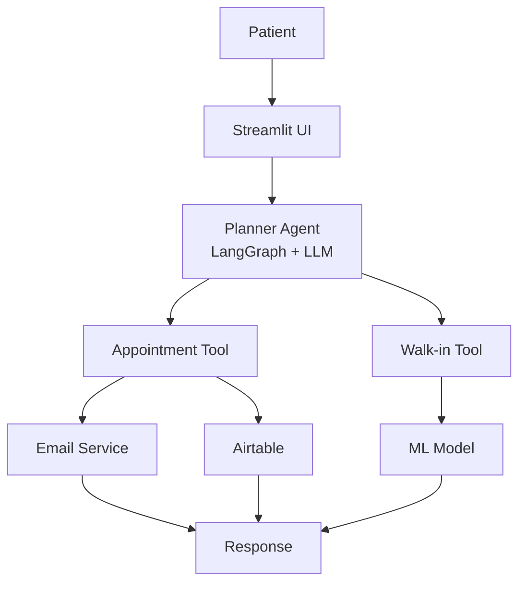

#  Clinic Chatbot

An AI-powered clinic assistant that helps patients book appointments and predict walk-in crowd levels using a combination of **Agentic AI**, **LangGraph**, **LLMs**, and a **Machine Learning model**.

##  Live Demo

 **Live Demo:** https://clinic-chatbot-agent-01.streamlit.app/

---

##  Features

###  Appointment Booking
- Guides patients through the appointment booking process.
- Collects:
  - Preferred date and time
  - Patient name
  - Email address
- Sends appointment confirmation via email.
- Automatically logs bookings to Airtable.

###  Walk-in Crowd Prediction
- Predicts clinic busyness for a selected date and time.
- Classifies expected crowd levels as:
  -  Free
  -  Normal
  -  Busy
- Suggests quieter nearby time slots when the clinic is expected to be busy.


##  Architecture



---

##  How It Works

The LLM acts as a **planner**, not a predictor.

It decides:
- Whether the user wants an appointment or a walk-in visit.
- Which tool should be called.
- How to present the final response.

The actual crowd prediction is performed by a trained Machine Learning model.

### ML Pipeline

The prediction model consists of:

1. **Custom Feature Engineering**
   - Extracts:
     - Hour
     - Day of Week
     - Session (Morning/Evening)

2. **OneHotEncoder**
   - Encodes categorical features.

3. **DecisionTreeRegressor**
   - Predicts expected visit count.

Predicted visit counts are converted into crowd labels:

```python
LOW, HIGH = 2.0, 4.0

# count <= LOW  -> Free
# count <= HIGH -> Normal
# count > HIGH  -> Busy
```

---

##  Environment Variables

Create a `.env` file in the project root:

```env
OPENROUTER_API_KEY=your_openrouter_key
OPENROUTER_MODEL=openai/gpt-4o-mini

EMAIL_SENDER=your_gmail_address
EMAIL_PASSWORD=your_gmail_app_password

AIRTABLE_API_KEY=your_airtable_personal_access_token
AIRTABLE_BASE_ID=your_airtable_base_id
AIRTABLE_TABLE_NAME=Bookings
```

### Notes

- Gmail requires an App Password.
- OpenRouter API keys can be created at https://openrouter.ai/keys
- Airtable tokens can be created at https://airtable.com/create/tokens
- Email and Airtable integrations are optional.

---

##  Installation

### 1. Clone the Repository

```bash
git clone https://github.com/mayaannkkk/Clinic-ChatBot-Agent.git

cd clinic-chatbot
```

### 2. Install Dependencies

```bash
pip install -r requirements.txt
```

### 3. Run the Application

```bash
streamlit run app.py
```
